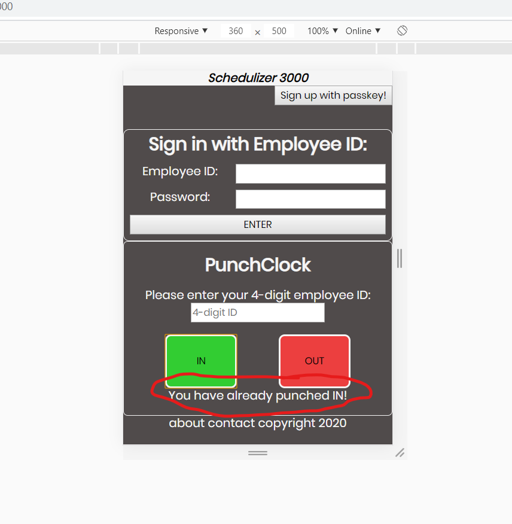

# Final Project: The Schedulizer 3000

## The Schedulizer is designed as a tool for employers and employees to use as an integrated scheduling, notification, punchclock and payroll system, to be used by staff and administrators in a shift-based work environment. It will be built using React, Node.js, MongoDB, and Redux, and also makes use of Immer and Moment.js.

### Main Features:

1. Three Separate but integrated UIs: Manager account, Employee account and Punchclock interface. Employee account is mobile-oriented and built outwards from a small screen size, whereas the manager's version is built with a desktop-oriented layout. The punchclock UI is displayed on the main page of the app, so people can enter a PIN to punch in without having to sign into their account.

2. Mongo DB database to store information relating to previous schedules, punchclock records, payroll (derived from approved punchclock activity), and notifications.

3. Server will handle all interactions between the Front-End and Database.

### Details on Manager-side features:

1. Manager can view employees' information and create new employee profiles (updates and deletions coming in version 1.1).

2. Manager can create new schedules (viewing previous schedules, updating and deleting coming in version 1.1).

3. Manager can view, and validate/unvalidate all punch-clock records, with several options of selecting the time period.

4. When manager POSTS a schedule it immediately becomes visible by the employees, who can see their own shifts but no one else's.

5. Manager can send notifications to all staff or to individual employees and receive confirmation when the notification is viewed.

6. Manager can review all payroll information before uploading a week's pay stubs. Payroll data is generated by calculating an employee's wages from their (validated) hours worked during a week, multiplied by their hourly wage. Payroll breakdown on manager's account shows all of this information by employee, by date, as well as the total wages being paid during the selected pay period.

### Details on Employee-account features:

1. Employee can sign in with their 4-digit ID number and personal password.

2. Employee can see their schedule when it is posted, and navigate from week to week to see all of their schedule history/upcoming weeks.

3. Employee can see their current punch status (In, with the time they punched in, or out).

4. Employees can recieve notifications from their manager in an inbox. Inbox UI is a list of the subject lines of all notifications an employee has recieved, and by clicking the subject line of a notification the employee can access its full text. The first time a notification is clicked, a time-stamped read-receipt is generated and associated with that employee's 'Read-status' in the database for that notification, and the manager can see this confirmation when they view their sent messages.

5. Employees can see a history of their weekly pay stubs, each of which contains their hours worked for a given week, their hourly wage, total pay, tax rate (currently a flat 30% for everyone) and net earnings.

### Details on Punchclock interface:

1. Built into the App's pre-sign-in UI/main page.

2. Employees punch in by hitting a button and entering their personal ID number.

3. Repeated punches of the same type are not accepted to prevent pollution of the database, and a warning message is displayed in the event of a double-punch. Only valid employee ID numbers are accepted by the punchclock.

4. All punches are immediately visible on the manager's screen so they can be validated. Employees can also see their current punch status if they sign into their account page.

## Lessons Learned:

1. This was my first real heavy-duty use of MongoDB and also a real level-up experience for using Redux and Immer (which, once I understood its use, was absolutely fantastic). Also solidified a lot of React fundamentals like when to use state versus using props, and creating component heirarchies.

2. Mongo collections: If I were to start all over again, I would have taken advantage of the fact that Mongo lets you have as many different collections as you like, in order to have a 'flatter' heirarchy in my database. The current design works well enough but the more your data is nested the harder it becomes to easily access and/or change specific entries, so that is a lesson learned for the future.

3. Generic Components: As my React components list grew I found myself doing quite a lot of copying of very similar but not quite identical components such as rows for a weekly data column, or employee detail displays. In some cases I was able to use one component with different props but often there was a lot of duplication which, had I had a clearer picture of exactly what would be needed at the outset, could have been avoided/reduced.

4. Redux stores: This project made extensive use of Redux and Immer, both of which I really enjoy using. However, the Redux stores used in this project are probably unnecessarily complicated due to the fact that I was kind of learning as I went, and so there was some fairly harmful duplication/overlapping of information between different stores which makes the code harder to read/modify than it should be.

5. Flowcharts: At the very beginning of the project I drew a few pictures of how the UI should look, and how the data would flow from DB to server to FE and vice versa, as well as some basic sketches of how the database would be structured. These were invaluable and I should have done even more of them before jumping into the actual coding, as nothing hinders a project more than realizing mid-way through developing something that you don't have a crystal-clear picture of how things should be structured. I think the fact that I'm still quite new to coding makes some mid-stream rethinking inevitable, but having a diagram that you can consult really helps to keep you on track, and making such a diagram forces you to think through a lot of details before you get started. Plus they're fun to make!

6. Directory organization: As the project grew so did the amount of components, pages, and server endpoints, and by the end they were quite daunting and not particularly navigable. Lots of commenting throughout the code helped to alleviate this, but I would definitely give more thought to organizing the file structure of my next project. Even though it doesn't directly affect the App's functionality it makes a big difference in the process of developing and fixing features once they've been added.

## Coming Soon: The Schedulizer v.1.1!

### Since this was a two-week project there were a few features that either didn't make the cut, or which were implemented with less than 100% perfect functionality. Here are the features I intend to develop further for future versions:

1. Full view of all previous schedules for the manager.

2. Edit ability for current and future schedules for manager.

3. Ability for manager to update employees' data, or delete them (termination/resignations).

4. Ability for manager to remove invalid punches from the database.

5. Behind-the-scenes cleanup of the code and file directories for better organization.

6. Pagination for pages which might grow to have long lists, such as punchclock records and payroll.

7. Condensed punch-in/punch-out column for employee punch records, to reduce the length of punchclock list and also make it easier to keep track of an individual worker's times.

8. Employees can change certain details of their profiles (notably passwords).

9. General aesthetic touch-ups here and there.

10. Future future versions: Hosting with Firebase or Herokuapp.
